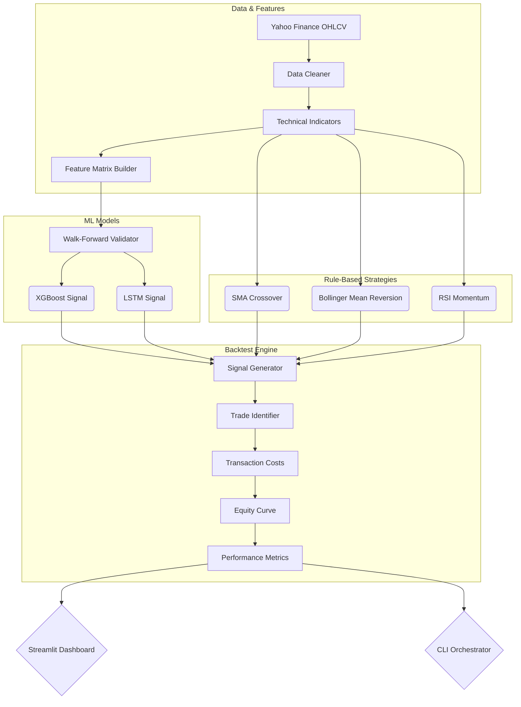

<div align="center">
  <h1>📈 QuantTradingBot</h1>
  <p><b>Machine Learning-Powered Quantitative Trading Research Platform</b></p>

  [](https://www.python.org/)
  [](https://pytorch.org/)
  [](https://xgboost.readthedocs.io/)
  [](https://streamlit.io/)
  [](https://opensource.org/licenses/MIT)
</div>

---

## 🚀 Overview

QuantTradingBot is an end-to-end quantitative trading backtesting engine and research platform. 

Initially built as a simple Moving Average Crossover tutorial, this project introduces a robust machine learning pipeline capable of predicting next-day returns using tree-based models and deep neural networks, wrapped in an interactive Streamlit dashboard.

### Key Capabilities

*   🧠 **Machine Learning Signals:** Predict market direction using **XGBoost classifiers** and **PyTorch LSTMs** trained on 12+ technical indicators.
*   📊 **Multiple Strategies:** Compare ML strategies head-to-head against traditional baselines (SMA Crossover, Bollinger Mean Reversion, RSI Momentum).
*   🛡️ **Robust Validation:** Uses anchored **walk-forward cross-validation** to test models over time, rigorously preventing data leakage and overfitting.
*   📈 **Professional Metrics:** Automatically computes CAGR, Sharpe Ratio, Sortino Ratio, Calmar Ratio, Win Rate, and Max Drawdown.
*   🎲 **Risk Modeling:** Includes **Monte Carlo simulations** to bootstrap thousands of possible future equity curves and estimate confidence intervals.
*   🖥️ **Interactive UI:** A full **Streamlit dashboard** for dynamic backtesting, parameter tuning, and Plotly visualization.

---

## 🏗️ System Architecture



---

## ⚙️ Installation

1.  **Clone the repository:**
    ```bash
    git clone https://github.com/Abhics8/QuantTradingBot.git
    cd QuantTradingBot
    ```

2.  **Create a virtual environment (Recommended):**
    ```bash
    python3 -m venv venv
    source venv/bin/activate  # On Windows: venv\Scripts\activate
    ```

3.  **Install dependencies:**
    ```bash
    pip install -r requirements.txt
    ```

---

## 🎮 Usage

### Option 1: Streamlit Dashboard (Recommended)

The easiest way to interact with the backtester and visualize the data:

```bash
streamlit run app.py
```
*This launches a local web app where you can select tickers, dates, toggle ML strategies, and view interactive Plotly charts.*

### Option 2: CLI Orchestrator

For rapid testing and automation from the terminal:

```bash
# Compare ML vs Traditional strategies on Apple stock
python run_backtest.py --ticker AAPL --strategies sma bollinger rsi xgboost lstm --start 2020-01-01

# Run Monte Carlo simulation on a specific strategy
python run_backtest.py --ticker SPY --strategies xgboost --monte-carlo

# Fast mode (uses fewer estimators/epochs for quicker debugging)
python run_backtest.py --ticker MSFT --strategies xgboost --fast-mode
```

---

## 📂 Project Structure

```text
QuantTradingBot/
├── app.py                      # Streamlit interactive dashboard
├── run_backtest.py             # Command-line backtest orchestrator
├── quantbot/                   # Core Python package
│   ├── data/                   # Data fetching & cleaning (Yahoo Finance)
│   ├── features/               # Technical indicators & feature engineering
│   ├── models/                 # ML models (XGBoost, LSTM) & Validation
│   ├── strategies/             # Trading strategy implementations
│   ├── backtest/               # Backtest engine & performance metrics
│   └── portfolio/              # Markowitz optimization & Monte Carlo
└── ma_crossover.py             # Original v1.0 monolithic script
```

---

## 💡 Resume Impact

This project demonstrates strong capabilities in:
- **Data Science:** Feature engineering, time-series analysis, walk-forward validation.
- **Machine Learning:** Tree-based models (XGBoost), Deep Learning (PyTorch LSTMs).
- **Software Engineering:** Object-oriented design, modular architecture, UI development (Streamlit).

---

## 📝 License

This project is licensed under the MIT License - see the [LICENSE](LICENSE) file for details.
